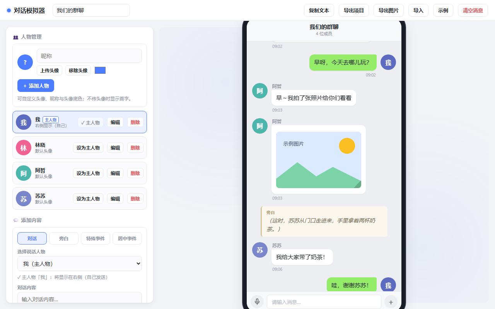

# 对话模拟器（群聊生成工具）

一个纯前端的 Web UI 应用，用来制作像微信群聊 / QQ 群聊一样的对话截图或演示。



> **在线演示**：<https://tipsong.github.io/chat-simulator/>（由 GitHub Actions 自动部署）

## 功能

### 人物管理
- 添加 / 编辑 / 删除人物
- 自定义**昵称**、**头像**（上传后可在弹窗中拖动/缩放并裁剪为正方形）、**头像底色**
- 可将任意一个角色**设为主人物**：主人物（"自己"）的消息自动显示在**右侧**绿色气泡，其余角色显示在左侧

### 四种内容类型
| 类型 | 说明 |
|------|------|
| 对话 | 选择说话人物，输入内容，可附带**图片**（选图后可"使用原图 / 正方形裁剪 / 长方形裁剪"）；主人物自动显示在右侧，其余在左侧 |
| 旁白 | 居中、带标签的斜体旁白，如"（窗外下起了雨…）" |
| 特殊事件 | 与旁白同位置居中显示，❤️ 爱心标签 + 粉色卡片样式 |
| 居中事件 | 居中的灰色系统提示，如"XX 加入了群聊" |

### 消息编辑
- 鼠标悬停到任意消息上，可**编辑 / 上移 / 下移 / 删除**
- 编辑时可改**时间**（右下角显示的时间）
- 对话中的图片可**拖拽右下角手柄调整大小**（比例保持）
- 点击聊天中的图片可放大查看

### 外观与持久化
- 自定义聊天标题、聊天背景（多套浅色/渐变/深色）
- **自适应对话高度**：手机画面随对话长短自动伸缩（可关闭）；导出图片时自动展开为完整高度
- **显示时间**：总开关，关闭后聊天里不显示时间、编辑弹窗也不显示时间输入框
- **显示输入框**：手机底部微信风格输入条（左语音圆点 + 中间输入框 + 右加号圆形），可一键隐藏
- **气泡样式**：侧栏「气泡样式」二级菜单里直接编辑气泡 CSS（带注释 + 左右气泡预览），点击「应用样式」实时生效
- 数据自动保存到浏览器 `localStorage`；可**导出项目**（JSON）随时**导入**恢复
- **导出图片**：整段聊天导出为 PNG 截图；**复制文本**：复制全部对话

## 项目结构

```
chat-simulator/
├── index.html            # 页面入口（HTML 结构）
├── package.json
├── vite.config.js        # 标准多文件构建（dist/，用于 GitHub Pages）
├── vite.singlefile.config.js # 单文件离线构建（dist-single/，用于分享）
├── LICENSE
├── legacy/
│   └── chat-simulator.singlefile.html   # 旧版单文件（备份，仅作参考）
└── src/
    ├── style.css         # 全部样式
    ├── main.js           # 入口：初始化流程
    ├── state.js          # 状态、常量、持久化
    ├── utils.js          # 纯工具函数
    ├── data.js           # 示例数据
    ├── render.js         # 渲染层（DOM 构建）
    ├── characters.js     # 人物管理
    ├── messages.js       # 消息管理（composer / 编辑弹窗）
    ├── crop.js           # 头像 & 图片裁剪
    ├── export.js         # 导入 / 导出 / 复制文本
    ├── bubbleStyle.js    # 气泡样式自定义（CSS 编辑 + 注入）
    └── events.js         # 事件绑定
```

> 说明：`render.js` 与 `characters.js` / `messages.js` 之间存在**循环依赖**
> （渲染按钮回调调用动作函数，动作函数又触发重绘）。ES 模块的 live binding
> 能正确处理这种仅在函数体内发生的相互调用，故无需担心。

## 开发

需要 [Node.js](https://nodejs.org/)（18+）。

```bash
# 安装依赖
npm install

# 启动开发服务器（热更新）
npm run dev

# 构建生产版本（输出到 dist/，用于部署）
npm run build

# 构建离线单文件版（输出到 dist-single/index.html，双击即用）
npm run build:single

# 本地预览构建产物
npm run preview
```

## 部署到 GitHub Pages

推送到 `main` 后，`.github/workflows/deploy.yml` 会自动构建并部署到 Pages。

首次使用需在仓库做一次设置：**Settings → Pages → Source 选 "GitHub Actions"**。

部署成功后可访问：`https://tipsong.github.io/chat-simulator/`（`.github/workflows/ci.yml` 则负责每次 push/PR 的构建检查）。

## 使用

- **开发**：`npm run dev`，浏览器打开 Vite 提示的地址（默认 `http://localhost:5173`）。
- **生产**：`npm run build` 后，把 `dist/` 目录部署到任意静态服务器（或直接 `npm run preview` 本地预览）。
- **离线单文件（分享用）**：`npm run build:single` 生成 `dist-single/index.html`，JS/CSS 全部内联、已压缩混淆、**完全离线、不暴露源码**，可直接双击打开或发给他人。
- 旧版单文件（可直接双击打开）见 `legacy/chat-simulator.singlefile.html`，仅作备份，不随源码维护。

## 分享打包（离线单文件）

适合把成品直接发给他人、或放到任意环境双击打开：无需服务器、无需联网、不暴露源码。

```bash
npm run build:single
```

- 产物为 `dist-single/index.html`（约 270 KB），JS/CSS 全部内联并压缩混淆，html2canvas 也已打包在内，**完全离线可用**。
- 复制该文件即可分享；也可将其压缩为 zip（如 `chat-simulator-share.zip`）便于通过聊天软件发送。
- `dist-single/` 与分享 zip 已被 `.gitignore` 忽略，**不进入仓库**，需要时用上面的命令重新生成。

## 依赖说明

- **html2canvas**（导出图片用）已作为本地依赖随构建打包，导出图片**完全离线可用**，无需联网。
- 图片与头像均以 Data URL 内嵌在项目 JSON 中，导出/导入不会丢失。

## 快捷键
- `Ctrl + Enter`：快速添加当前对话内容
- `Esc`：关闭弹窗 / 关闭图片放大

## 许可

[MIT](./LICENSE)
